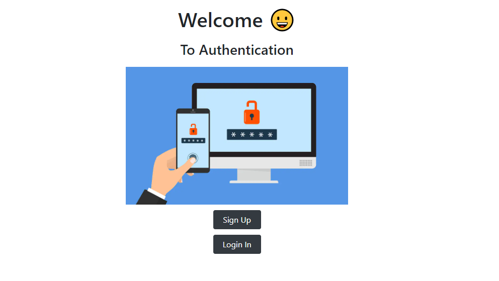
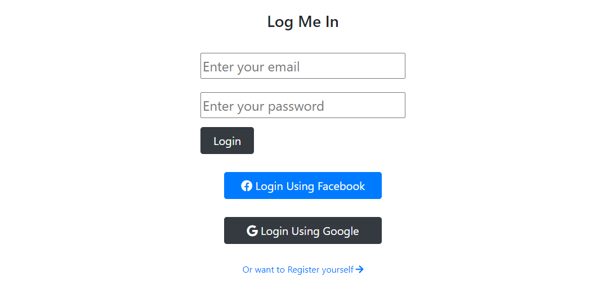
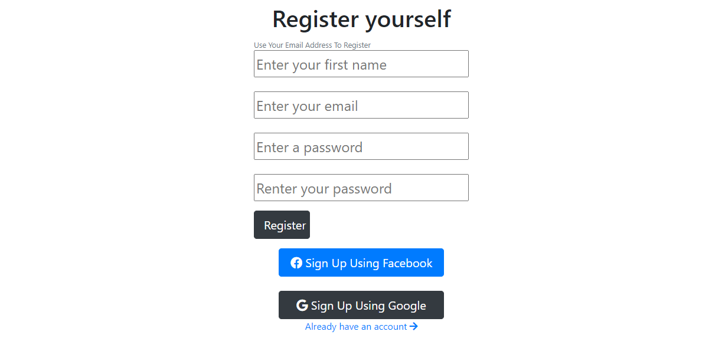
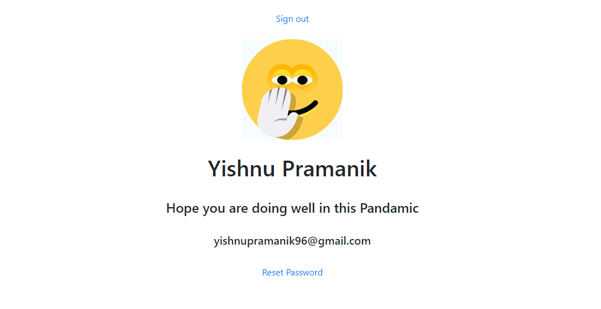
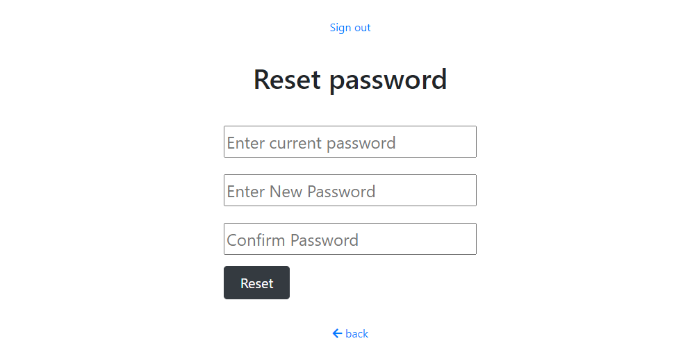

# NodeJS Authentication App
 A complete authentication app with login, logout, register, For jump start any application using Node Js, And Express

### Welcome page


### Sign-In Page


### Sign-Up Page


### Main Page


### Reset Page


## Technologies Used
1.  NodeJS
2.  Express
3.  EJS
4.  MongoDB
5.  Mongoose
6.  PassportJS

## Prerequisites
- Git
- NodeJS
- Text Editor

## Installation

##### Clone the latest Repository

`git clone https://github.com/yishnu96/Authentication`

##### Into the project directory

`cd Authentication `

##### Installing NPM dependencies

`npm install`

#### Configration og credentials
Make a file name key.js and put the following credentials <br>
```
    module.exports = {
        // for Application
       MONGO: '-',           //mongoDB connection url
        SECRET_KEY: '-',      // any secret key to encrypt

        // facebook credentials 
        // you will find more details on 
        // https://developers.facebook.com/docs/facebook-login/web

        FACEBOOK_APP_ID: '-',           // facebook App Id
        FACEBOOK_APP_SECRET: '-',       // facebook App Secret Code
        FACEBOOK_CALLBACK_URL: 'http://localhost:5429/auth/facebook/callback',


        // google credentials
        // you will find more details on 
        // https://cloud.google.com/community/tutorials/cloud-functions-oauth-gmail

        GOOGLE_CLIENT_ID: '-',          //google clint Id
        GOOGLE_CLIENT_SECRET: '-',      //google clint Secret key
        GOOGLE_CALLBACK_URL: 'http://localhost:5429/auth/google/callback'
    }
```
##### Then simply start your app

`npm start`

#### The Server should now be running at http://localhost:5429/

## Folder Structure

    nodejs-auth 
    ├── assets 
    │ --- ├── scss
    │ --- ├     └── layout.sass
    │ --- └── css
    │ -------- └── layout.css 
    ├── config 
    │ --- ├── mongoose.js
    │ --- ├── passport-facebook.js
    │ --- ├── passport-google.js
    │ --- ├── key.js        //you have to made
    │ --- └── passport-local.js
    ├── controllers
    │ --- └──auth_Controller.js
    ├── models 
    │ --- └── User.js 
    ├── node_modules 
    ├── routes 
    │ --- ├── authentication.js
    │ --- └── user.js
    ├── views <br>
    │ --- ├── home.ejs
    │ --- ├── layout.ejs
    │ --- ├── reset.ejs
    │ --- ├── signin.ejs
    │ --- ├── signup.ejs
    │ --- └── user.ejs
    ├── .gitignore 
    ├── app.js
    ├── package.json 
    ├── package-lock.json 
    └── README.md
